# JX HV5932MG Servo Teardown

Reverse engineer report for JX HV5932MG-360 servo

## Enclosure

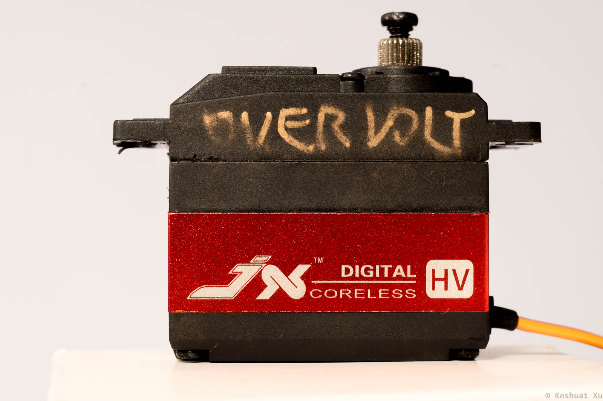

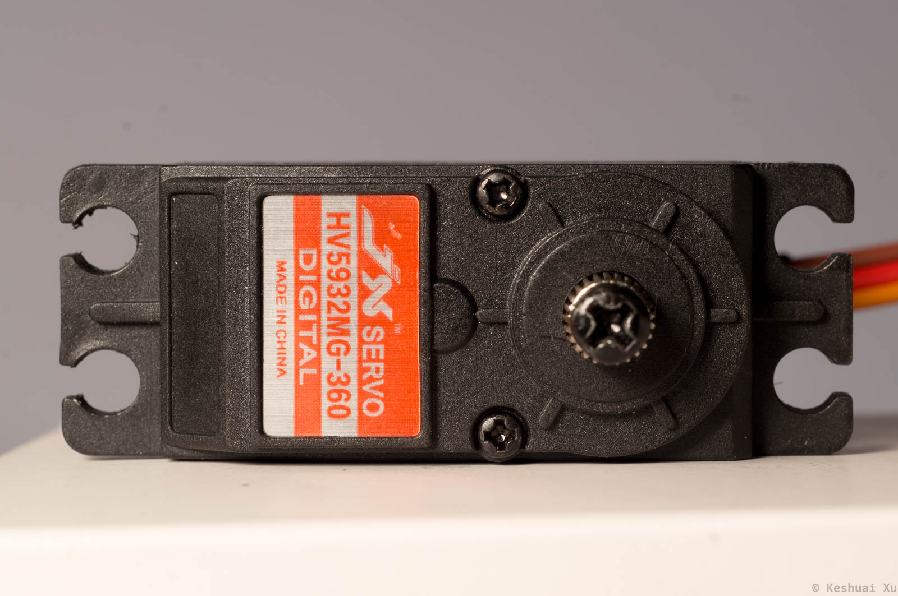

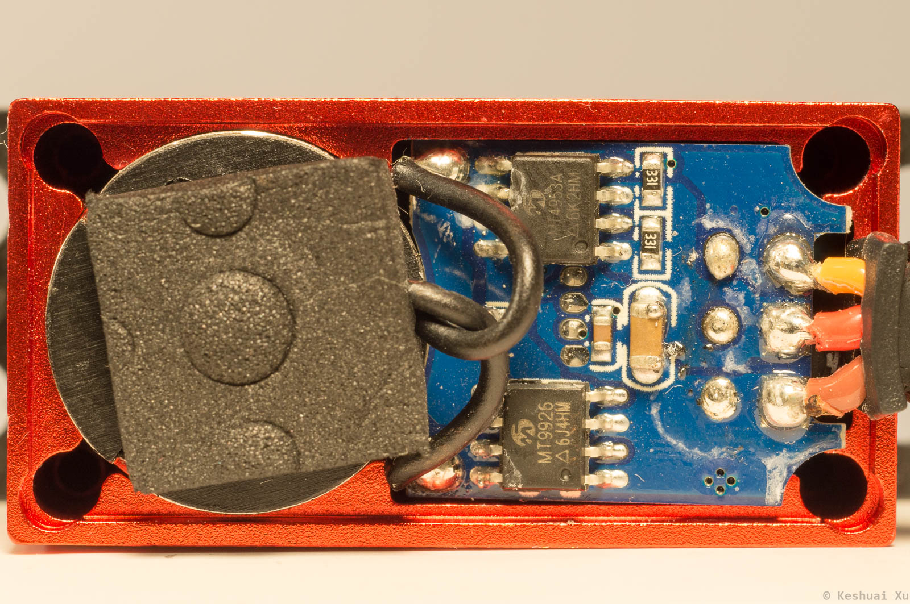

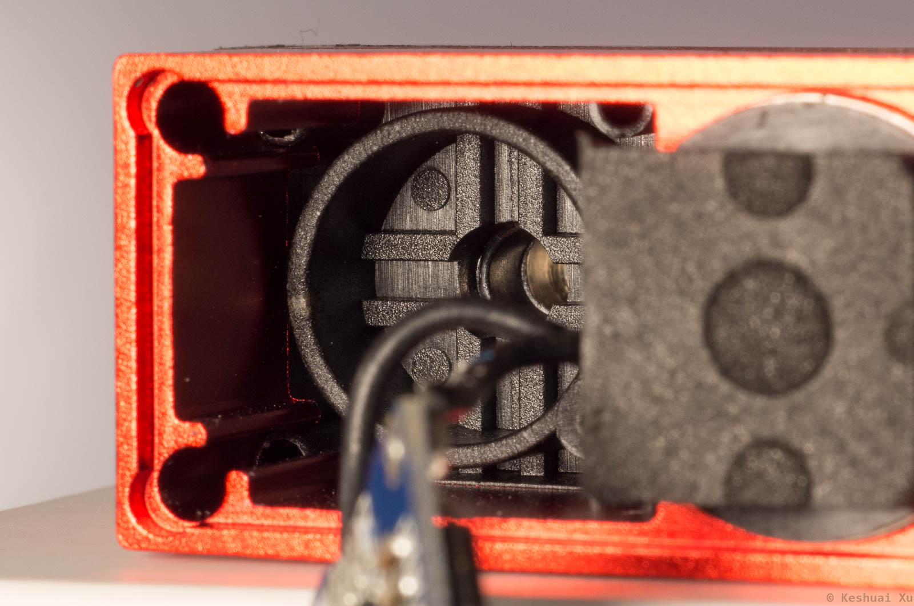

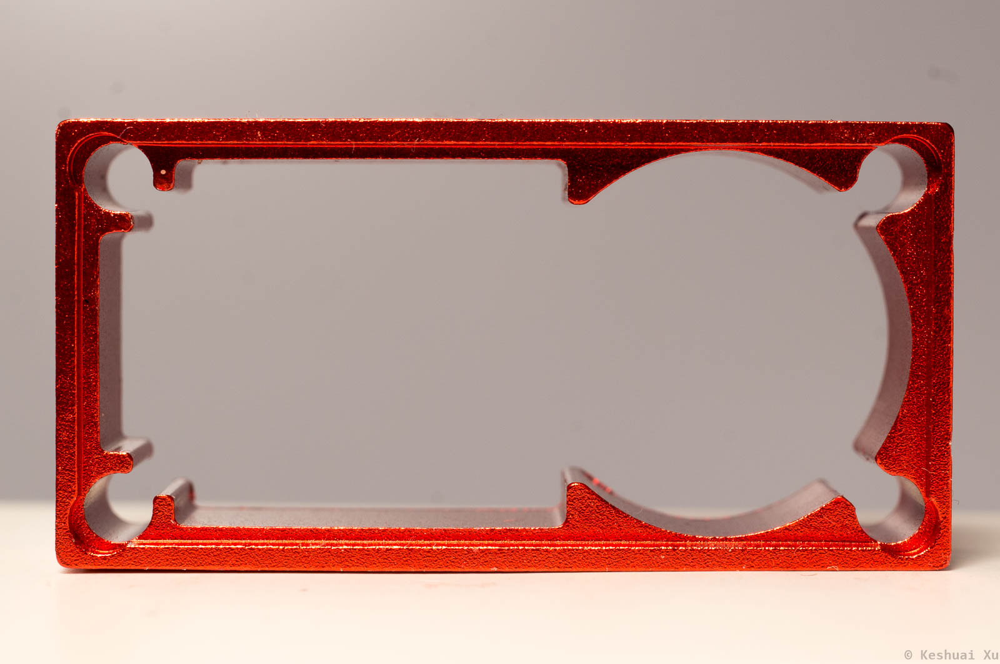

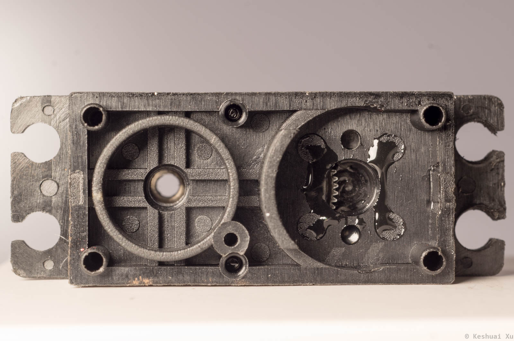

### Review

Pro

- Look and feel is good

Con

- Poor thermal conductivity between extruded aluminum casing and the motor. Can be improved by adding thermal paste.
- No brass inserts for the screws. Screw hole threads strip after a couple disassembly cycles.

## Controller

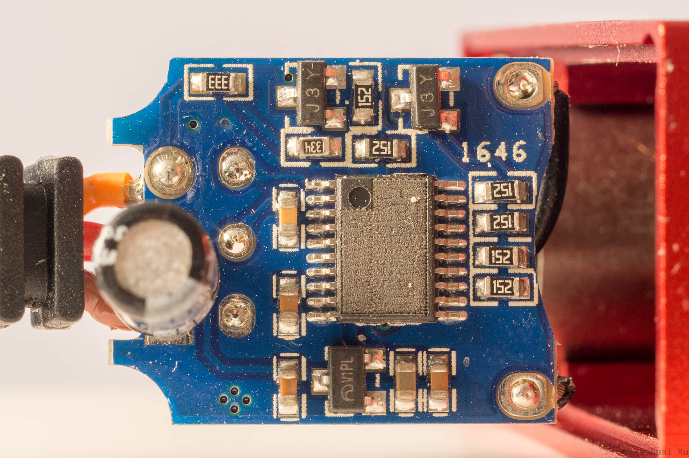

Servo controller chip marking is lasered off. Suspect a variant of `MAC900` servo ASIC. MAX900 requires an external crystal and uses a different pin for PWM input. The same board is used in both servo and continuous rotation motor models. There are some contact pads on the other side of the board, possibly for programming/configuration.

**`J3Y`** `S8050` NPN transistors. Ic = 0.5 A. Vce_max = 25 V. They are possibly gate drivers.

**`V1PL`** no information found. Likely an LDO. This board has been overvoltaged to 30 V and there is a short to ground after the LDO.

Input bulk capacitor rated for 16 V 100 uF.

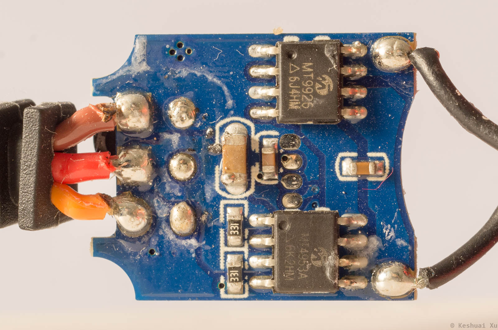

**`MT4953A`** dual P-channel MOSFET. Id = -5 A. Vds = -20 V. Rds_on = 84 mOhm @ 4.5 V.

**`MT9926`** dual N-channel MOSFET. Id = 6 A. Vds = 20 V. Rds_on = 22 mOhm @ 4.5 V.

### Review

Pro

- H-bridge is strong with adequate headroom.
- PCB is compact and well-designed.

Con

- Hand soldering quality is poor.
- Lasering off chip marking reveals insecurity.
- Motor PWM frequency is probably low (~400 Hz).


## Motor

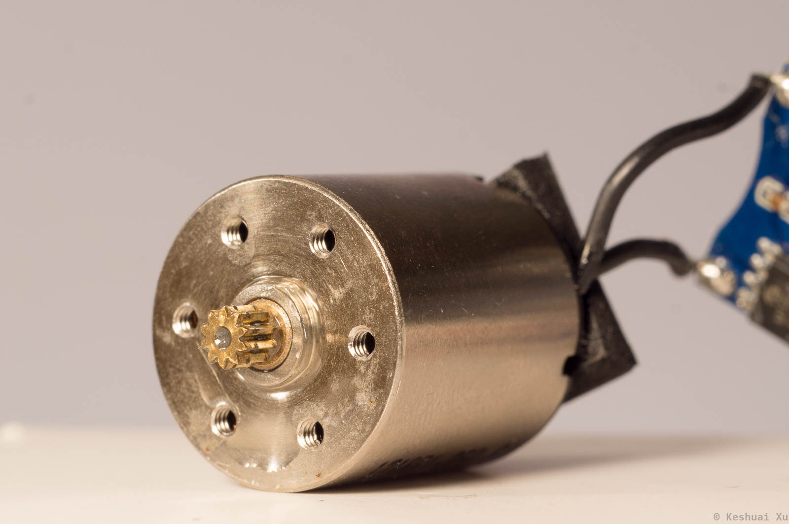

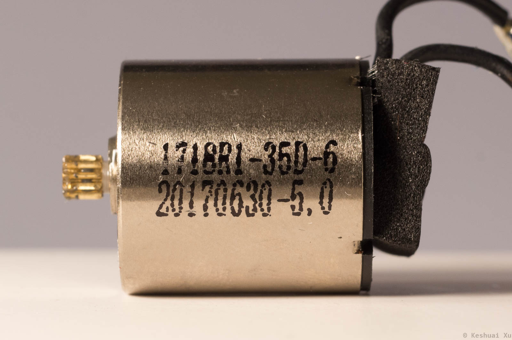

It is verified to be a coreless motor. The casing is machined. Terminal resistance: 1.13 Ohm.

Motor marking:

```
1718R1-350-6
20170630-5,0
```

Suspected manufacturer: [Sinbad Motor](http://www.sinbad-motor.com/prod_view.aspx?TypeId=27&Id=175&FId=t3:27:3), a Chinese motor manufacturer that makes drop-in Maxon replacements. They seem to offer maxon-style customization. I couldn't find a datasheet on the their website. The product page says the maximum efficiency is 85% (I don't believe it). The retail price of the motor is about $10 - $15.

### Review

Pro

- The look and feel of the motor are excellent. 

Con

- Brass bushing instead of ball bearings for the shaft.

## Gearbox

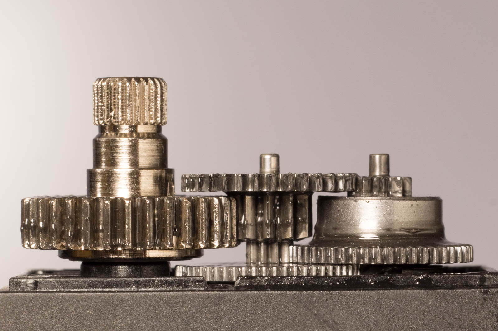

```
Stage 1: Aluminum
Stage 2 and 3: Carbon Steel
Stage 4: Stainless Steel
```

Lubricant contains large number of metal particles.

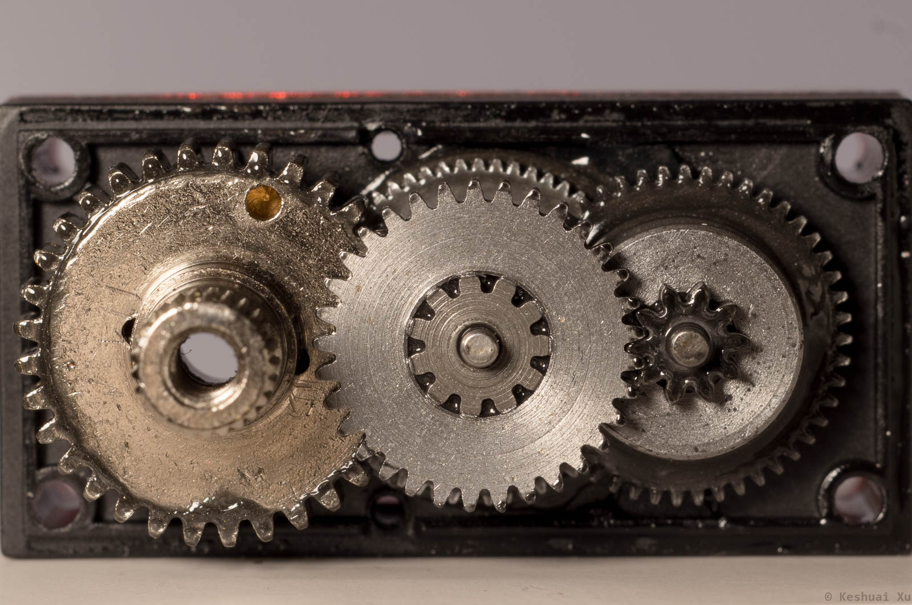

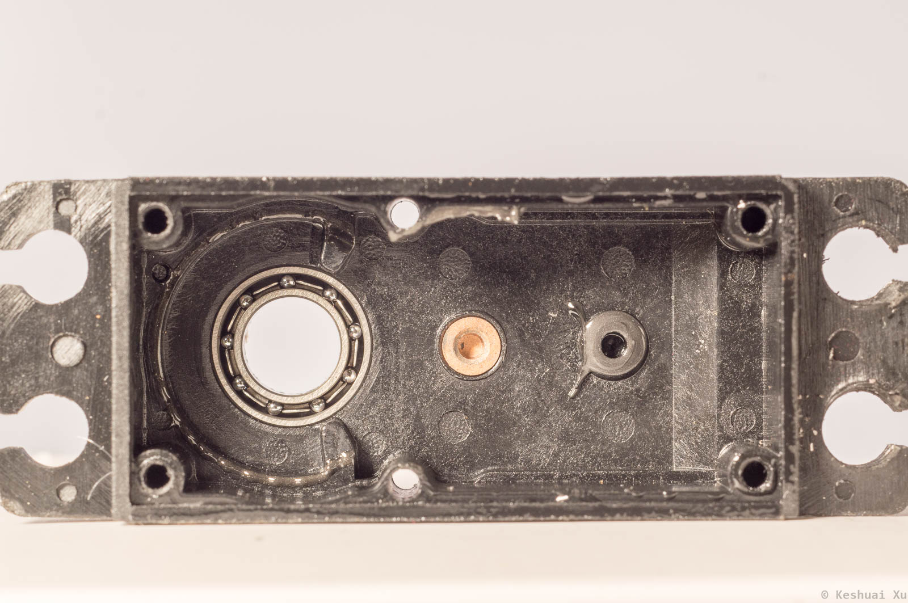

### Review

Pro

- Expensive output shaft material and process.
- Good backlash performance for the price.

Con

- Metal particles in the lube.
- Gearbox is not as smooth as I would like.
